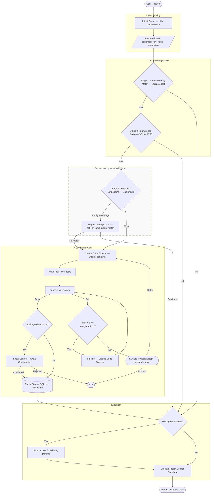

# Sharp Tools — v0 Design Document

## Overview

Sharp Tools is an agentic harness that provides users with on-demand, reusable utilities. Instead of asking an LLM to perform a task inline (e.g., "strip all semicolons from this file"), the harness generates, tests, and caches a purpose-built script that can be invoked repeatedly with zero LLM overhead. The core value proposition is **token efficiency**: a cached Go binary that strips semicolons is faster, cheaper, and more reliable than asking a model to do it every time.

---

## Goals

- Reduce token consumption by routing repetitive tasks to cached scripts
- Generate robust, tested tools on demand
- Enable code review before execution (with an opt-out config)
- Persist tools locally for future reuse
- Remain interface-agnostic, with CLI as the v0 surface

---

## Architecture



---

## Components

### 1. Intent Parser

A lightweight LLM call that normalizes user input into a structured intent:

```json
{
  "intent": "convert tiff to png",
  "input_type": "file",
  "output_type": "file",
  "parameters": ["source_path", "dest_path"],
  "tags": ["image", "conversion", "tiff", "png"]
}
```

This structured intent is used for cache lookup. The intent parser should use the smallest capable model to minimize token cost.

### 2. Tool Cache & Lookup

The cache stores tool metadata, binaries, and intent records. Lookup is a sequential pipeline — each stage only runs if the previous stage misses. The pipeline is designed so that **miss cost scales with cache value**: early stages are essentially free, and more expensive stages are only added once the cache is large enough to benefit from fuzzy matching.

#### v0 Lookup Pipeline

```
Structured Key Match (SQLite exact)
        │
        ├── [Hit]  → Execute
        └── [Miss] → Intent Tag Overlap (SQLite FTS)
                          │
                          ├── [Hit]  → Execute
                          └── [Miss] → Generate new tool
```

**Stage 1 — Structured Key Match**

The intent parser produces a normalized canonical key from the structured intent fields:

```
operation:convert | input:tiff | output:png
```

Exact SQLite lookup on this key. Miss cost: ~0. No false positives.

**Stage 2 — Intent Tag Overlap**

The intent parser extracts tags (e.g. `[image, convert, tiff, png]`). It is given a preferred tag list — common values for formats, operations, and data types — and instructed to use them when they fit. It is free to emit novel tags when the tool doesn't map to anything on the list. This ensures common synonyms normalize consistently (e.g. `jpg` and `jpeg` both resolve to `jpg`) while leaving long-tail tools unconstrained.

On a key miss, SQLite FTS5 scores cached tools by tag overlap. A configurable minimum overlap score is required to accept a match.

Miss cost: ~0. Slightly more flexible than key matching — catches equivalent tools with minor phrasing differences in their stored tags.

#### Future Lookup Pipeline (vX)

Two additional stages added after intent tag overlap:

**Stage 3 — Semantic Embedding**

Embed the normalized intent and query a local vector index for nearest neighbors. Match accepted if similarity score exceeds the upper threshold (default: 0.9). Miss cost: one local model inference, no API call.

**Stage 4 — Ambiguous Range Prompt**

If similarity falls in the ambiguous range (default: 0.7–0.9), the user is asked to confirm before the match is accepted:

```
→ Possible match: tiff-to-png-converter
  "Convert TIFF images to PNG format using standard color profiles"
  Use this tool? [Y/n]
```

A "no" answer triggers generation of a new tool. This stage can be disabled via config for automation and scripting contexts — a score in the ambiguous range is treated as a miss when `ask_on_ambiguous_match: false`.

#### Storage

SQLite for all metadata. Tool binaries and source on the filesystem, referenced by path.

**Schema (sketch):**

| Table | Key columns |
|---|---|
| `tools` | id, name, description, language, created_at, version, reviewed |
| `intents` | id, tool_id, raw_input, canonical_key, tags, created_at |
| `runs` | id, tool_id, invoked_at, exit_code, duration_ms |

#### Design Rationale

Semantic embedding lookup was the original design, but carries two risks: false positives (similar embeddings for tools that are actually different, e.g. "jpg to png" vs "tiff to png") and expensive miss paths for ephemeral or first-time users who have no cache yet. A multi-stage approach with an LLM verification layer was considered but rejected for v0 — LLM calls on the lookup path defeat the token-efficiency goal when the cache is cold.

The chosen approach keeps miss cost at zero for v0 (pure SQLite), reserves the expensive stages for a future version when users are more likely to have a populated cache, and adds a human confirmation layer only for the ambiguous range — not for all cache hits — to avoid training users to dismiss prompts and to preserve automation compatibility via config.

### 3. Code Generation

The code generation component is a **pluggable sidecar** — the harness defines a strict interface and treats the sidecar as a black box. This allows the sidecar to be swapped across versions without touching the rest of the system. The contract is:

- **In:** structured intent + target language + constraints
- **Out:** source files + pass/fail test result

Cached tools carry no record of which sidecar produced them. A tool generated by the v0 sidecar and one generated by a later sidecar are identical from the harness's perspective.

#### Sidecar Roadmap

**v0: Claude Code sidecar**

Claude Code runs as a Docker sidecar — isolated from the host, authenticated via `ANTHROPIC_API_KEY` passed as an environment variable. The harness spins up the container on a cache miss, passes a generation prompt, and reads the output artifact from a mounted volume. Claude Code handles the write→test→fix loop internally.

This is a deliberate shortcut: the agentic loop is a known-good black box, which lets v0 focus on validating the cache pipeline, CLI, Docker orchestration, and the overall harness flow without also building a custom agent.

**Sidecar interface contract**

*Input:* The harness invokes Claude Code non-interactively via `claude -p "<prompt>"`. The prompt is the only control surface and must specify: what to build, the target language, the output directory, and the instruction to write tests and not exit until they pass.

*Output:* Claude Code writes to a mounted volume with the following structure:

```
/output/
├── manifest.json
├── source/
│   └── main.go          # (or main.py / index.ts)
└── tests/
    └── main_test.go
```

`manifest.json` carries the structured metadata the harness needs to populate the cache:

```json
{
  "tool_name": "tiff-to-png-converter",
  "description": "Converts TIFF image files to PNG format",
  "language": "go",
  "parameters": [
    { "name": "source_path", "type": "string", "required": true },
    { "name": "dest_path",   "type": "string", "required": false }
  ],
  "tests_passed": true
}
```

The harness reads `manifest.json` on container exit. `tests_passed: false` means Claude Code exhausted its own loop without convergence — the harness surfaces the best attempt to the user. Container exit code serves as a redundant signal.

**vNext: Third-party coding agent sidecar**

Swap the Claude Code sidecar for a different coding agent and model — same interface, different implementation. Validates that the sidecar abstraction is clean and allows cost/quality optimization independently of the harness.

**vX: Self-built agentic coder**

Replace the third-party sidecar with a purpose-built agent. A single agent generates the tool and its own unit tests, runs them in the Docker sandbox, and iterates on failures autonomously. The loop continues until all tests pass or `max_iterations` is reached. On exhaustion, the harness surfaces the best attempt to the user.

```
Agent generates tool + unit tests
        │
        ▼
Run tests in Docker sandbox
        │
        ├── [Pass] ──► return artifact
        └── [Fail] ──► Agent fixes tool ──► Re-run tests
                              ▲                   │
                              └─── (iterate) ─────┘
                                        │
                                   [max_iterations]
                                        │
                                        ▼
                               return best attempt + failure detail
```

**vX+: Adversarial Loop**

Two agents work in opposition:

- **Writer Agent:** Generates the tool and a list of edge cases it has handled.
- **Tester Agent:** Generates test cases independently — including adversarial inputs not mentioned by the Writer — runs them, and reports failures with specific inputs and actual vs. expected outputs.

The loop iterates until all tests pass or max iterations is reached.

**Dialogue mode (vX+, optional):** The user can be looped in at each iteration to provide feedback or clarify requirements. Configurable via `dialogue_mode`.

### 4. Execution Sandbox

The sandbox is a **pluggable interface** — the active backend is set via config. This allows swapping implementations without changing tool execution logic.

**v0 backend: Docker**

Each tool invocation runs in an isolated container:
- No network access (unless explicitly required and user-approved)
- Read access to specified input paths only (bind-mounted)
- Write access to specified output paths only
- CPU/memory limits

Pre-built base images are maintained for all three supported runtimes: `golang:alpine`, `python:3.12-slim`, `node:22-alpine`.

Test execution during code generation also runs inside Docker — generated tests are treated as untrusted code in the same way as the tool itself.

**Why Docker for v0:** It's the only option with good macOS support, and it's what most developers already have installed. Isolation is sufficient for a local developer tool.

**Available sandbox backends (current and future):**

| Backend | Isolation | Overhead | Platform | Notes |
|---|---|---|---|---|
| `docker` *(v0)* | Kernel namespaces | ~500ms cold start | Mac + Linux | Pragmatic default; shares host kernel |
| `gvisor` | Userspace kernel (no host kernel exposure) | ~2–3x syscall overhead | Linux | Run as Docker runtime (`--runtime=runsc`); production-grade |
| `nsjail` | Linux namespaces + seccomp-bpf | Very low | Linux only | Designed for short-lived code execution; used by Morph, Google CTF infra |
| `wasm` | Capability-based, formally verified | ~10ms cold start | Cross-platform | Long-term goal; limited stdlib support for Python today |
| `none` | None | None | Any | Opt-out for trusted/automated workflows |

**Open questions:**
- Pre-built base images vs. build-on-demand (first-run latency tradeoff)
- Container reuse vs. fresh container per run (performance vs. isolation tradeoff)
- How to handle long-running tool processes

### 5. Code Review Flow

Before first execution of a newly generated tool, the user is shown the source code and asked to confirm. This is the default behavior.

The source is read from `/output/source/` on the sidecar's mounted volume before it is written to the cache. If the user rejects, the output is discarded and nothing is cached.

Config option `require_review: false` disables this for fully automated workflows.

Review is only prompted **once per tool version**. If a cached tool is invoked again without changes, no review is required.

### 6. Persistence

```
~/.sharp-tools/
├── sharp-tools.db          # SQLite: tool metadata, intent records, run history
├── tools/
│   ├── <tool-id>/
│   │   ├── source/         # Source code
│   │   ├── bin/            # Compiled binary (for compiled languages)
│   │   └── tests/          # Generated test cases
└── config.toml             # User configuration
```

**SQLite schema (sketch):**

| Table | Key columns |
|---|---|
| `tools` | id, name, description, language, created_at, version, reviewed |
| `intents` | id, tool_id, raw_input, canonical_key, tags, created_at |
| `runs` | id, tool_id, invoked_at, exit_code, duration_ms |

### 7. Configuration (`~/.sharp-tools/config.toml`)

```toml
[generation]
default_language = "go"        # "go" | "python" | "typescript" — harness falls back to this when no language is clearly better suited
max_iterations = 10            # Max self-correction iterations before surfacing to user (vX — Claude Code sidecar manages its own loop in v0)

[execution]
sandbox = "docker"             # "docker" | "none"
require_review = true          # Show code before first run

[cache]
tag_overlap_min_score = 0.6         # Minimum tag overlap score to accept a match (v0)
similarity_threshold_accept = 0.9   # Auto-accept semantic match above this score (vX)
similarity_threshold_prompt = 0.7   # Prompt user for matches in this range to threshold_accept (vX)
ask_on_ambiguous_match = true        # Set false to treat ambiguous range as a miss (for automations)

[model]
intent_parser = "claude-haiku-4-5-20251001"
# writer and tester models are vX+ config (adversarial loop)
```

---

## Supported Languages

Sharp Tools supports exactly three target languages for generated tools:

| Language | Runtime | When to use |
|---|---|---|
| **Go** (default) | Compiled binary | File I/O, data transforms, anything performance-sensitive |
| **Python** | CPython | Tasks requiring scientific libraries, image processing (Pillow), or where Go stdlib is a poor fit |
| **TypeScript** | Node.js (tsx) | Tasks that are inherently JS-native, e.g. JSON/DOM manipulation, web-oriented transforms |

No other languages are permitted. The harness selects the language automatically based on the intent, but **strongly prefers Go**. Python or TypeScript are only chosen when there is a clear practical reason (e.g., a well-known Python library with no Go equivalent). The chosen language is stored in the tool record.

Pre-built Docker base images are maintained for all three runtimes: `golang:alpine`, `python:3.12-slim`, and `node:22-alpine`.

---

## CLI Interface (v0)

```bash
# Request a tool (natural language)
sharp-tools "convert all tiff files in this directory to png"

# List cached tools
sharp-tools list

# Inspect a tool's source
sharp-tools inspect <tool-id>

# Run a cached tool directly
sharp-tools run <tool-id> [args...]

# Remove a cached tool
sharp-tools remove <tool-id>

# Show config
sharp-tools config
```

### Runtime Context Prompting

When the harness doesn't have enough context to run a tool — for example, a file path wasn't provided — it interactively prompts the user:

```
$ sharp-tools "convert this tiff to png"
→ Matched cached tool: tiff-to-png-converter
  Source file path: _
```

The intent parser identifies required parameters, and any not provided in the original request are collected via interactive prompt before execution. This applies to both cache hits (parameters known from the tool record) and newly generated tools (parameters declared by the sidecar as part of its output artifact).

---

## Token Efficiency Strategy

The primary goal is to **avoid LLM calls whenever possible**:

1. **Cache hit → zero LLM tokens.** A matched cached tool runs with no model call.
2. **Intent parsing is cheap** — small model, structured output, minimal context.
3. **Cache lookup is free** — structured key and tag overlap are pure SQLite queries, no model call.
4. **Generation is only invoked on cache miss** — and results are cached indefinitely.

Over time, the cache accumulates tools and the LLM is invoked less frequently for common tasks.

---

## Future Roadmap

### Code Generation Sidecar

| Version | Sidecar | Goal |
|---|---|---|
| v0 | Claude Code (Docker) | Validate harness infrastructure — cache, CLI, orchestration |
| vNext | Third-party coding agent | Validate sidecar abstraction; optimize cost and model choice |
| vX | Self-built agentic coder | Full control over the generation loop and feedback signals |
| vX+ | Adversarial loop | Separate writer and tester agents for higher correctness |

### Cache Lookup

| Version | Addition |
|---|---|
| v0 | Structured key match + tag overlap (SQLite) |
| vX | Semantic embedding (local model) + ambiguous range prompt |

### Everything Else

- **MCP Integration:** Expose Sharp Tools as an MCP server so it can be used as a tool call source in Claude Code and other MCP-compatible hosts
- **Other interfaces:** REST API, library mode, IDE plugins
- **CC0 Tool Routing:** Detect when a well-known open-source tool exists for a task (e.g., `ffmpeg` for video conversion) and route to it instead of generating. Requires a curated registry.
- **Model Switching:** Dynamically select the cheapest model capable of the task, using capability scoring and token cost estimates
- **Sandbox alternatives:** gVisor (stronger isolation), nsjail (lower overhead on Linux), WASM (cross-platform, long-term)
- **Tool Sharing/Registry:** Publish and import tools from a shared registry
- **Versioning & Rollback:** Track tool versions with the ability to roll back
- **Streaming Output:** Real-time output from long-running tools
- **Dialogue mode:** Loop the user into the generation process for feedback at each iteration

---

## Open Questions

1. **Embedding model:** Local sentence-transformer chosen; specific model TBD pending benchmarking for accuracy vs. resource cost. The Go harness will call a local Python sidecar (or Ollama) over a local socket — this means a Python or Ollama dependency at runtime.
2. **Docker base images:** Pre-pulled vs. on-demand. First run will be slow if the Go or other language image isn't cached locally.
3. **Parallel tool generation:** If the user submits multiple requests, should generation run in parallel?
